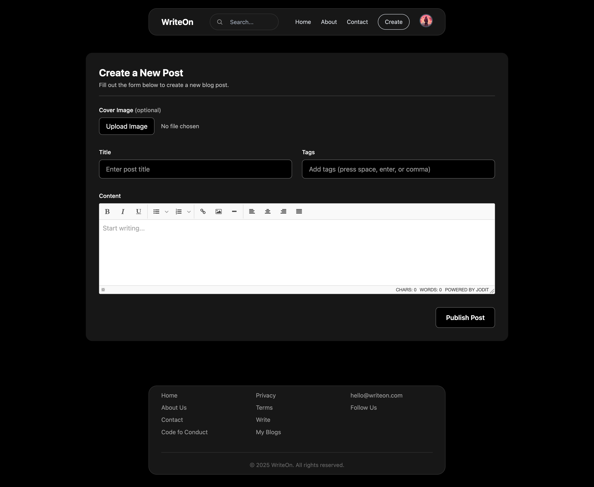
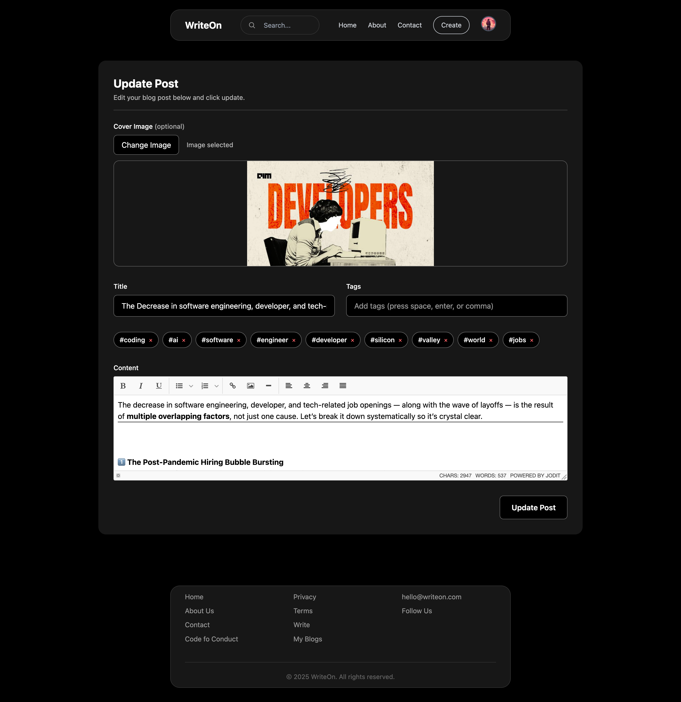

# WriteOn: Modern React Blog Platform

> A visually stunning, modular blog web app built with React and Vite. <br>
Create, update, and explore blog posts with a beautiful, responsive UI, rich text editing, and seamless navigation. <br>
Features include authentication, dynamic banners, paginated blog loading, tag-based filtering, and mobile-responsive design.

<br>

<br>

## Table of Contents
1. [About the Project](#about-the-project)
2. [Tech Stack](#tech-stack)
3. [Getting Started](#getting-started)
4. [Folder Structure](#folder-structure)
5. [Color Palette](#color-palette)
6. [Image Credits](#image-credits)
7. [API Credits](#api-credits)
8. [What I Learned](#what-i-learned)
9. [More Info](#more-info)

[⬆️ Back to Top](#dailybuzz-modern-react-news-portal)

<br>

<br>


## About the Project
WriteOn is a personal project designed to provide a modern, user-friendly blogging experience. Users can:

- Create, update, and delete blog posts with rich text formatting
- Browse recent posts in a dynamic grid layout
- Search posts by title, content, or tags
- Filter and discover related blogs by tags
- Enjoy a responsive UI with glassmorphism effects and floating header/footer
- Authenticate with Firebase (login/signup)
- Experience seamless navigation across desktop and mobile


## 🖼️ Output Preview

Here are some screenshots of WriteOn in action:

<div align="center">
   
   <br><sub>Homepage: Recent blog posts and dynamic banner</sub>
   <br><br>
   
   <br><sub>Create page: Rich text editor for new posts</sub>
   <br><br>
   
   <br><sub>Blog detail: Three-section layout with author, content, and tags</sub>
   <br><br>
</div>


[⬆️ Back to Top](#table-of-contents)

<br>

<br>


## Tech Stack
- **React** (with Hooks)
- **Vite** (fast development/build)
- **Tailwind CSS** (utility-first styling)
- **Firebase Firestore** (database)
- **Firebase Auth** (authentication)
- **Jodit Editor** (rich text editing)
- **Material Symbols** (icons)

[⬆️ Back to Top](#table-of-contents)

<br>

<br>


## Getting Started
1. **Clone the repo:**
   ```sh
   git clone https://github.com/ayush-sleeping/WriteOn.git
   cd WriteOn
   ```
2. **Install dependencies:**
   ```sh
   npm install
   ```
3. **Set up Firebase:**
   - Create a Firebase project at [Firebase Console](https://console.firebase.google.com/)
   - Enable Firestore and Authentication
   - Copy your Firebase config and paste it into `src/firebase-config.jsx`
4. **Run the app:**
   ```sh
   npm run dev
   ```
5. **Open in browser:**
   - Visit [http://localhost:5173](http://localhost:5173)


[⬆️ Back to Top](#table-of-contents)

<br>

<br>


## Folder Structure
```
WriteOn/
├── public/
│   └── vite.svg
├── src/
│   ├── assets/           # Images, logos, icons
│   ├── components/
│   │   ├── Header/
│   │   ├── Footer/
│   │   └── ...           # Other UI components
│   ├── pages/            # Home, Blog, Create, Update, etc.
│   ├── App.jsx
│   ├── main.jsx
│   ├── firebase-config.jsx
│   ├── index.css
│   └── App.css
├── package.json
├── vite.config.js
└── README.md
```
- Components are modular and grouped by feature
- Pages handle routing and CRUD operations
- Firebase config is kept in `src/firebase-config.jsx` (never commit secrets)


[⬆️ Back to Top](#table-of-contents)

<br>

<br>


## Color Palette
- **Primary:** #6C63FF (indigo)
- **Accent:** #FF6584 (rose pink)
- **Background:** #18181B, #23272F (dark glass)
- **Text:** #fff (white)
- **Other:** #2D2D34, #3A3A40 (glassmorphism overlays)

[⬆️ Back to Top](#table-of-contents)

<br>

<br>


## Image Credits
All images and logos used in this project are either custom-made or downloaded from Pinterest. Thanks to the creators for their work.

[⬆️ Back to Top](#table-of-contents)

<br>

<br>


## API Credits
Thanks to Firebase for providing free authentication and database services for personal projects.


<br>


## ⚠️ Firebase Security in Production

**Important:**
- For this personal/demo project, the Firebase config is included in `src/firebase-config.jsx` and basic Firestore rules are used for convenience and easy setup.
- For real production apps, **never expose sensitive keys or secrets in your frontend code or public repo**. Always use environment variables and keep secrets private.
- In production, you must set strict Firestore security rules to prevent unauthorized access and writes. Example:
   ```plaintext
   service cloud.firestore {
      match /databases/{database}/documents {
         match /posts/{postId} {
            allow read: if true;
            allow write: if request.auth != null;
         }
      }
   }
   ```
- Always review and update your Firebase rules in the Firebase Console before deploying a real app.
- For public deployments, restrict your Firebase rules and never allow open write access to your database.

[⬆️ Back to Top](#table-of-contents)

<br>

<br>


## What I Learned
- Building a modular, scalable React project structure
- Integrating Firebase Firestore and Auth for real-world CRUD and authentication
- Advanced React Router usage for dynamic blog pages
- Responsive UI/UX with Tailwind CSS and custom CSS
- Rich text editing integration with Jodit Editor
- Managing authentication state and protected routes
- Handling mobile-first design and glassmorphism effects

[⬆️ Back to Top](#table-of-contents)

<br>

<br>


## More Info
- This is a personal project; contributions are not accepted.
- Explore, learn, and enjoy blogging!

[⬆️ Back to Top](#table-of-contents)
